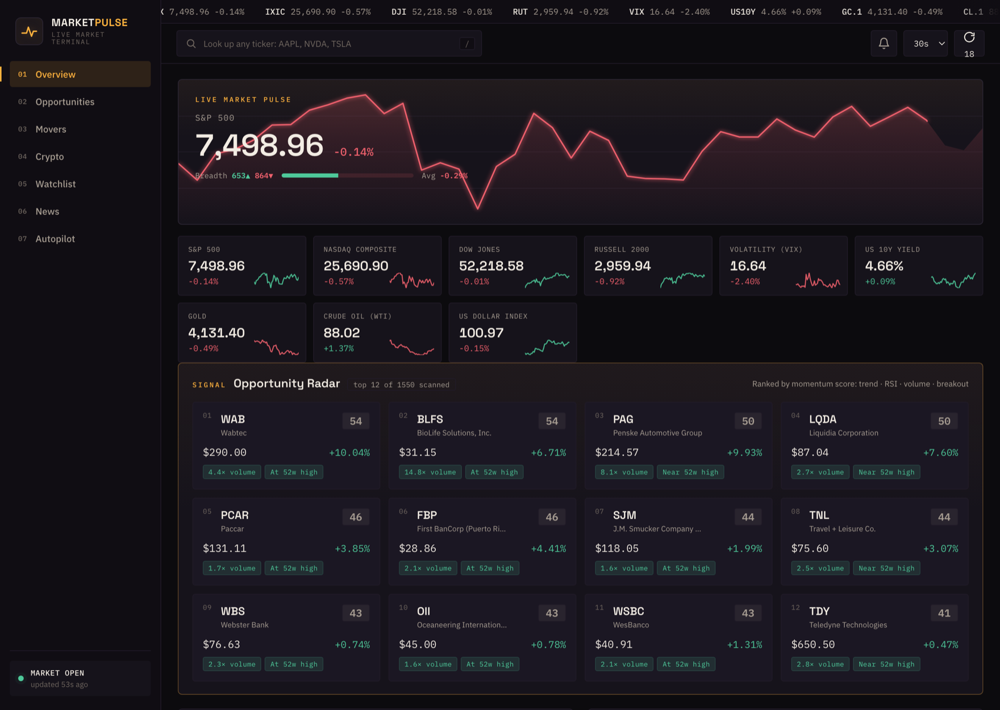

# PaperTrail: live stock screener and backtesting engine

A self-hosted market terminal that screens ~1,550 US stocks and the top 50 crypto every
60 seconds, rates each name 1–5 from transparent sub-scores, and computes concrete
entry timing with real price levels. It then backtests and forward paper-trades its own
signals, so you can see whether they work before risking a cent.


-blue)




## Does the score actually work?

Most stock screeners stop at the score. This one ships two engines built to answer whether
the scores beat just buying an index fund:

- a backtester that replays 2–10 years of real history through the exact same decision
  logic the live app uses, and
- two forward paper-trading books ($100k simulated each) that trade the signals live and
  track the result against an SPY buy-and-hold benchmark.

The result, reported in the app itself: the momentum/breakout signal set underperformed
buy-and-hold across three independent backtests (≈ −27 percentage points, 28% win rate).
Building the validation harness also surfaced three separate bugs that had inflated
backtest returns by 30+ points: survivorship bias, a hindsight-selected universe, and
stale entry pricing. The app reports all of that on screen, including when its own
signals are not worth acting on.

So the aim is transparent inputs, honest baselines, and a testing discipline that catches
the ways a backtest lies to the person who wrote it.

## Tech & engineering

- **Stack:** Node.js + Express backend, vanilla JS/HTML/CSS frontend. One runtime dependency,
  no build step, no framework. Installable to a phone home screen (PWA).
- **Data:** six free, no-key-required sources (CNBC, CoinGecko, Finnhub, FRED, Google News,
  Wikipedia) plus embedded TradingView charts. Optional API keys unlock analyst consensus and
  real macro series.
- **Testing:** 60 automated tests (`npm test`), written test-first, including look-ahead
  guards that prove a decision made on day *t* cannot see day *t+1*.
- **Architecture:** background refreshers keep a warm in-memory snapshot; the browser polls it,
  so pages load instantly and upstream APIs are never hammered.

## Quick start

```bash
git clone https://github.com/milanshaji1/paper-trail.git
cd paper-trail
npm install
npm start          # → http://localhost:4000
npm test           # run the full test suite
```

No API keys are required. Copy `.env.example` → `.env` to optionally add free Finnhub / FRED keys.

## What it shows

| Section | Content |
| --- | --- |
| **Macro strip** | S&P 500, Nasdaq, Dow, Russell 2000, VIX, 10Y yield, Gold, Oil, US Dollar |
| **Opportunity Radar** | Top names ranked by a composite 0–100 momentum score (trend, RSI, volume surge, breakout proximity, returns) |
| **Market Movers** | Top gainers / losers / most active across the tracked universe |
| **Crypto** | Top 20 coins (24h/7d, sparklines), trending coins, global market cap & BTC dominance (CoinGecko) |
| **Watchlist** | Add any ticker; saved in your browser (localStorage) |
| **Market News** | Live headlines across Markets, S&P 500, Crypto, Earnings (Google News RSS) |
| **Analysis view** | Click any row/card for a full breakdown: company summary, per-stock news, key data, and a **multi-horizon directional outlook** |

## Analysis view (per stock)

Click any ticker to open a detailed analysis with:

- **Company summary** (Wikipedia) and **recent news for that specific stock** (Google News)
- **Live interactive chart** embedded from **TradingView** (candles, volume, indicators)
- **Directional outlook across 1W / 1M / 1Y / 5Y / 10Y toggles.** Each horizon shows a
  Bullish → Bearish lean on a gauge, the confidence level, the exact signals feeding it,
  and a plain-English rationale:
  - **1W / 1M** — short-term technicals (price vs 20/50-day averages, RSI, MACD, momentum, volume)
  - **1Y** — primary trend (50/200-day golden/death cross), 3–6 month momentum, valuation sanity
  - **5Y / 10Y** — fundamentals: forward earnings & revenue growth, ROE, margins, leverage,
    valuation, plus long-run price CAGR
- **Key data**: RSI, 50/200-DMA, 6-mo return, 52w range, forward P/E, EPS/revenue growth,
  ROE, and 1y/5y/10y price CAGR

> The outlook is a transparent, rules-based heuristic and always shows its inputs.
> It is not a forecast, prediction, or advice. Long-horizon reads reflect business
> quality and trend rather than a price target. Nobody can reliably predict prices.

## Conviction rating (1–5) & entry timing

Every stock/ETF (and, lighter, every coin) gets a 1–5 conviction rating blended from
five transparent sub-scores (trend, momentum, quality, valuation, risk) with weights
that adapt when fundamentals are absent (ETFs, indices, crypto). Ratings show on the
Opportunity Radar cards and in the analysis view.

Alongside it, an **entry-timing** read answers *"when do I buy?"* with concrete price levels:
- **Buy zone (now)** — uptrend, not overbought, near rising support
- **Wait · dip** — strong but stretched; wait for a pullback toward the 20/50-day average (level given)
- **Wait · breakout** — coiled below resistance; wait for a close above $X (level given)
- **Wait · confirm** — trend unclear; wait to reclaim the 50-day on volume
- **Avoid** — downtrend below the 200-day; wait for a reclaim

…each with an **invalidation** level and a timing note (event-driven vs. days/weeks, plus a
dollar-cost-averaging suggestion for high-volatility names).

## Signal alerts (browser notifications)

Click the **bell** in the top bar and allow notifications. While the dashboard is open (a pinned
tab is fine), it watches your watchlist every refresh and notifies you, once per condition
per day, when a stock:

- enters its **buy zone**,
- pulls back into its **dip zone**,
- crosses its **breakout trigger**, or
- **reports earnings tomorrow**.

Clicking a notification opens that stock's full analysis. (No server push; the tab must be open.)

## Autopilot: two simulated strategies, head to head

Both are fully simulated: fake money, no brokerage, cannot place a real order.
They exist to answer one question: do these signals actually work?

**1. Breakout autopilot** (`lib/paper.js`) — follows the dashboard's own conviction +
entry signals. $100k book, risk-selectable, stops, earnings-aware.

**2. Momentum book (H1)** (`lib/momentum.js`) — a different strategy: rank every tracked
stock by its 12-month return skipping the last month, hold the top 15 equal-weight,
rebalance every 28 days, no stops. Trimming winners back to equal weight each month
is deliberate, and the tests cover it.

### What the evidence says so far

| | Result |
| --- | --- |
| Breakout signals, backtested 3 ways | Lost to SPY every time (≈ −27pp; 28% win rate; profit factor < 1) |
| 12-1 momentum, backtested (10yr, 3 universe slices) | Beat SPY in all three (25–33% CAGR vs 13.4%) |

**Read the second row skeptically.** Those backtests are inflated by:
- **survivorship:** the universe is *today's* index members, so companies that failed are invisible;
- **hindsight in the universe:** an alphabetical slice happened to be semiconductor-heavy in the best semi decade ever (that slice alone showed 33% CAGR vs 25% for a neutral slice);
- published long-only momentum earns ~15%/yr. Anything far above that is bias rather than alpha.

That's why the momentum book runs forward: picks made before the outcome is known, no
survivorship, no hindsight. Judge it over months.

### Pinned manual holds

You can also open a position by hand, bypassing the entry logic and the risk profile:

```bash
curl -X POST localhost:4000/api/paper/position \
  -H 'Content-Type: application/json' \
  -d '{"symbol":"VOO","amount":250}'
```

Pinned holds are never auto-closed. A 50% drawdown, an `AVOID` flip and a conviction collapse all
leave them alone, while an identical unpinned position closes. They carry no stop, because a number
the engine never acts on would imply protection that does not exist. They are still marked to market
every cycle, and `summary()` reports them separately, since mixing owner decisions into the engine's
closed-trade metrics would corrupt the record the book exists to produce.

Foreign listings are converted rather than approximated. `VAS.AX` trades on the ASX in AUD while the
book is denominated in USD; booking A$114.38 as US$114.38 would buy 2.19 shares instead of 3.09 and
misstate equity from then on. Prices convert on entry and on every subsequent mark, because
converting once is worse than not converting at all when later marks arrive in the local currency
again. If the rate is briefly unavailable the last known one is held rather than falling back to 1,
and a foreign position with no rate is refused rather than guessed. Auto-entry stays USD-only, since
the entry logic compares raw prices.

Run a backtest yourself from the Autopilot section, or `npm test` for the full suite
(including the look-ahead guards that prove a decision at day *t* cannot see day *t+1*).

## Catalyst & macro radar

- **Macro & Policy Wire** — a live feed of tariff / Fed / chip-curb / crypto-policy / energy /
  geopolitics headlines, each tagged by theme and bullish/bearish sentiment. (This is where a
  *"Trump threatens tariffs"* headline shows up, tagged to the sectors most exposed.)
- **Per-stock catalysts** — each name's recent headlines are classified by **type** (Earnings,
  Analyst, Deal, Regulatory, Policy, Product) and **sentiment**, with an aggregate news tone.
- **Macro exposure** — each stock is mapped to the macro themes it reacts to (e.g. semis →
  chip curbs + tariffs, banks → the Fed, COIN/MSTR → crypto policy).
- **Event-risk flag** — an unusual move on unusual volume gets flagged as likely news-driven.

> This gives context for headline-driven volatility. It does not predict how markets will
> react to any future event. It flags exposure and tone, nothing more.

## DJT Watch: phone alerts on market-moving posts

Watches Trump's Truth Social feed plus the official policy record, scores each item for market
impact, and pushes anything that clears the bar to Telegram. It runs on GitHub Actions every five
minutes, so it works overnight AEST while your Mac is asleep.

**Sources** (all free, no keys):

| Source | What it catches |
|---|---|
| Truth Social, via the [CNN mirror](https://ix.cnn.io/data/truth-social/truth_archive.json) | Where his market-moving posts land first |
| [whitehouse.gov/presidential-actions](https://www.whitehouse.gov/presidential-actions/feed/) | Executive orders, proclamations, memoranda |
| [Federal Register API](https://www.federalregister.gov/developers/api/v1) | The official, structured policy record |

There is **no X/Twitter coverage**. His X account is largely dormant, and every free bridge is dead:
Nitter, RSSHub, RSS-Bridge and the syndication CDN were all tested and all fail. Truth Social is
where it happens first anyway.

The archive is 19 MB, so polling it naively would move ~5 GB/day. Instead the watcher sends a
conditional `GET`, gets `304 Not Modified` on most cycles, and only then pulls the first 24 KB with
a `Range` request. That covers the newest ~47 posts, roughly 30 hours of his output.

### Scoring

Deterministic and keyless, so every alert decomposes into inputs you can check:

| Component | Max | What it measures |
|---|---|---|
| Mechanism | 40 | Does it name a lever that reprices assets: tariffs, rates, export controls, sanctions, drug pricing? |
| Entities | 25 | Named companies (`$TSLA`, "Apple"), the subject good, the counterparty country |
| Modality | 15 | *"I am imposing a 50% tariff"* against *"we're thinking about tariffs"*. The single biggest noise filter |
| Specificity | 10 | Names a rate, an amount, a date |
| Novelty | 10 | Recurring talking points decay toward zero |

Attribution is **evidence-led**: a mechanism alone attributes nothing. A copper tariff maps to
copper miners (FCX, SCCO) and the industries that buy copper, not to the semiconductor complex
because "tariffs" nominally touches chips. Where a post both protects and hurts the same ticker, it
is reported as mixed rather than claimed for both sides.

The scorer reads formal register too. The Federal Register never says "tariff", it says
*"adjustment to competition from imports"*, and a proclamation's commitment is the fact of the
document rather than its phrasing. Without that vocabulary the highest-signal source scores as noise.

Calibrated against all 35,329 archived posts:

```bash
node scripts/djt-calibrate.js --band=high --sample=20
```

At the default threshold that is **~1 alert/day**. The distribution is bimodal with a natural gap at
30–39, and the 20–29 band is Daylight Saving Time opinions and book plugs, which is why the bar sits
where it does. `DJT_BAND_MEDIUM` moves it.

### What an alert says

Each alert opens with two plain sentences: what the item is, and who it lands on.

> **What it means:** The White House published a tariff measure on aluminum, already in force as
> published. On the stated mechanism that is a tailwind for AA and CENX and a headwind for TSLA, F,
> GM and RIVN (+4 more).

The summary describes the mechanism's direction of pressure, never a price. Where the wording does
not settle whether a measure is being applied or lifted, it says so and notes that both exposure
lists flip on that answer.

### Token launches

A contract address or launchpad link bypasses the scoring bands entirely, because *"My NEW Official
Trump Meme is HERE"* scores near zero on policy mechanisms. Checked against the full archive: three
hits in 35,329 posts, all three real (the $TRUMP launch, its retruth, and $MELANIA). Those alerts
carry the contract address and state the latency limit up front, because the historical repricing
happened in minutes.

> Flags **plausible market relevance**. It does not predict direction, size or duration, and nothing
> it produces is advice.

## Meme Radar: early momentum, behind a hard safety gate

Scores **acceleration, not level**. A token already trending is late by definition. It compares each
token's 5- and 15-minute windows against its own hourly baseline (volume, unique buyers, buy/sell
skew), rewards being early, small and not-yet-discussed, and penalises sell-dominant flow,
wash-scale turnover and paid DexScreener promotion.

Sources: GeckoTerminal (new + trending pools), DexScreener (paid-boost signal), 4chan `/biz/`
(chatter, used only to tell "already loud" from "not yet"). All free, all keyless.

**Safety runs first and rejects outright.** It is a gate, not a score component:

- Solana via [RugCheck](https://rugcheck.xyz): rugged flag, live mint or freeze authority, top-10
  concentration, holder count, risk score
- EVM via [GoPlus](https://gopluslabs.io): honeypots, `cannot_sell_all`, pausable transfers,
  confiscatory buy/sell taxes, unverified source, owner concentration
- Both: token names using bidi or zero-width characters to disguise the symbol

Thresholds were set against positive controls. An earlier version rejected on RugCheck's
insider-network flag, which filtered out BONK and WIF, meaning every token that has ever actually
worked. That is now a warning rather than a rejection. The dashboard shows the rejection log beside
the candidates, so the gate stays auditable instead of silently swallowing everything.

Every alert also opens a simulated position in a forward paper-trading book, so the radar builds a
visible record instead of asking to be trusted. Costs are charged at 3% per side, peak price is
tracked separately from the exit (so a bad signal is distinguishable from a bad exit rule), and the
scorecard refuses to report a win rate as meaningful below 20 closed trades.

> **Most new tokens go to zero and a meaningful share are deliberate rugs.** "Catch it early"
> selects, by construction, for tokens that have not rugged *yet*. This is a shortlist to research,
> never a signal to buy, and it is not advice.

### Running the watchers

```bash
node scripts/djt-watch.js --dry-run
```

```bash
node scripts/meme-watch.js --dry-run --show-all
```

Both print what they would send and write nothing.

### Telegram delivery

```bash
node scripts/telegram-setup.js --from-clipboard
```

Reads the bot token from your clipboard, verifies it against Telegram, finds your chat id from the
first message you send the bot, writes both to `.env` and fires a test alert. The token is never
printed; only a masked fingerprint appears in the output. Create the bot first with `/newbot` in
[@BotFather](https://t.me/BotFather).

Without those two values the watchers still run, score and publish to the dashboard. They just stay
silent. For the 24/7 run, set the same two as GitHub repo secrets; `.github/workflows/watch.yml`
does the rest and publishes state to an orphan `djt-data` branch that the dashboard reads.

Latency is **5–20 minutes**, because GitHub's scheduled runs are best-effort and queue under load.
This is a *"what did he just say and what does it hit"* tool, not an execution edge.

## How it works

- A small **Express** backend runs background refreshers that keep an in-memory
  snapshot warm (stocks every 60s, crypto every 90s, news every 5m). The browser
  polls `/api/dashboard` and always gets an instant response.
- **Stocks / indices** come from Yahoo Finance's public chart endpoint
  (server-to-server, no key). ~6 months of daily candles per symbol are used to
  derive price, % change, RSI(14), 20/50-day SMAs, 1M/3M returns, volume surge
  and the opportunity score.
- **Crypto** comes from the free CoinGecko public API.
- **News** comes from Google News RSS.

No accounts, keys, or paid data feeds needed.

## Run it

```bash
cd /Users/milanshaji/Stocks
npm install
npm start
```

Then open **http://localhost:4000**.

Change the port with `PORT=8080 npm start`.

## Getting the most up-to-date data

Out of the box this uses free, key-free sources: CNBC (stocks/indices, effectively
~real-time-to-15-min), CoinGecko (crypto, ~1 min), Google News, Wikipedia, and
embedded TradingView live charts. That's plenty for monitoring, but if you want true
tick-level real-time quotes in the *data* (not just the embedded chart), add a provider key:

| Provider | Free tier | Best for |
| --- | --- | --- |
| **Finnhub** | Yes — real-time US stocks via WebSocket, company profiles, news, **analyst price targets & recommendations** | The single best free upgrade |
| **Alpaca** | Yes (with free account) — real-time US market data API + WebSocket | Real-time quotes/bars |
| **Polygon.io** | Yes (delayed); paid real-time | Deep historical + real-time |
| **Twelve Data / Tiingo / Financial Modeling Prep** | Yes (rate-limited) | Fundamentals, forex, extra coverage |
| Crypto: **Binance / Coinbase WebSocket** | Yes — truly real-time, no key | Live crypto ticks |

**About TradingView specifically:** TradingView does not offer a public REST API to pull
their quote data into your own app (their terms prohibit redistributing their feed). What they
do offer, and what this dashboard already uses, is free embeddable widgets (the live
chart in the analysis view). So "connecting to TradingView" means embedding their charts (done)
rather than reading their data feed. For live *data* to drive the numbers/signals, use one of the APIs
above (Finnhub recommended).

### Unlock more accuracy (free, optional; no key required to run)

The app reads optional keys from a `.env` file. Copy `.env.example` → `.env`, paste any key(s),
and restart. Nothing breaks without them.

```bash
cp .env.example .env      # then edit .env and paste your key(s)
```

- **`FINNHUB_API_KEY`** (biggest win) — analyst consensus (buy/hold/sell counts, folded
  into the 1–5 conviction rating at ~20% weight) plus upcoming earnings dates: cards get a
  📅 badge, and the entry plan warns when a report is ≤14 days away (binary event risk).
  Free key: <https://finnhub.io/register>
- **`FRED_API_KEY`** — US macro series (Fed funds, 10Y, 10Y–2Y spread, CPI, core CPI,
  unemployment) shown as a live indicator strip above the Macro & Policy Wire. Free: St. Louis Fed.
- **`COINGECKO_DEMO_KEY`** — higher crypto rate limits / fresher updates. Free.

The startup log and `/api/health` show whether a key is active, so you can confirm it loaded.

## Customize

- **Track more tickers** → edit `lib/universe.js` (`NAMES` map). Everything you
  add is scanned for movers and the Opportunity Radar. Mind Yahoo's rate limits
  if you add hundreds.
- **Tune the opportunity score** → `lib/indicators.js` (`opportunityScore`).
- **Refresh cadence** → constants at the top of `server.js`.

## Disclaimer

Data is delayed (typically ~15 min) and provided as-is. The Opportunity Radar
score is an automated momentum heuristic, not investment advice, a
recommendation, or a prediction. Markets are risky; do your own research.

## Project layout

```
server.js            Express app + background refreshers + API
lib/universe.js      Tracked symbols & names
lib/yahoo.js         Yahoo Finance provider + per-symbol metrics
lib/crypto.js        CoinGecko provider
lib/news.js          Google News RSS provider
lib/indicators.js    RSI / SMA / returns + opportunity score
public/              Frontend (index.html, styles.css, app.js)

lib/telegram.js      Shared alert transport (no-ops without a token)
lib/djt/impact.js    Market-impact scorer — pure, no I/O, unit-tested
lib/djt/sources.js   Truth Social (conditional GET + byte range), WH RSS, Federal Register
lib/djt/state.js     Seen-ids, alert log, HTTP caching metadata
lib/djt/feed.js      Reads published state for the dashboard (local, else djt-data branch)
lib/meme/momentum.js Acceleration scoring
lib/meme/safety.js   The hard gate — RugCheck (Solana) + GoPlus (EVM)
lib/meme/sources.js  GeckoTerminal, DexScreener, /biz/
scripts/djt-watch.js     Watcher entrypoint (--dry-run, --verbose)
scripts/meme-watch.js    Radar entrypoint (--dry-run, --show-all)
scripts/djt-calibrate.js Replays the scorer over the full archive
.github/workflows/       24/7 watcher + CI
```
